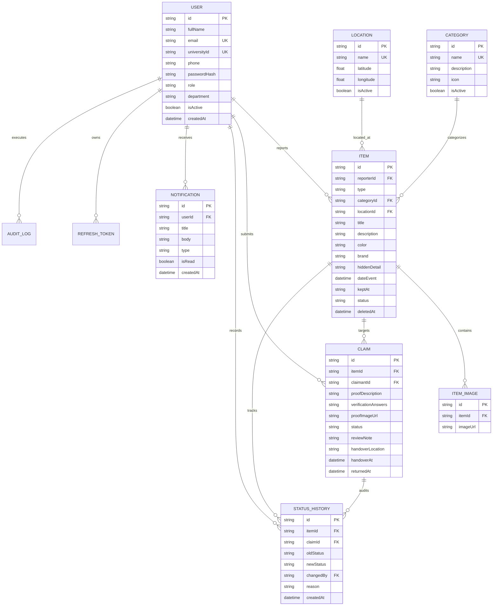

# Entity Relationship Diagram: Injibara Campus Lost & Found

```mermaid
erDiagram
    USER ||--o{ ITEM : "reports"
    USER ||--o{ CLAIM : "submits"
    USER ||--o{ STATUS_HISTORY : "records"
    USER ||--o{ NOTIFICATION : "receives"
    USER ||--o{ REFRESH_TOKEN : "owns"
    USER ||--o{ AUDIT_LOG : "executes"

    CATEGORY ||--o{ ITEM : "categorizes"
    LOCATION ||--o{ ITEM : "located_at"

    ITEM ||--o{ ITEM_IMAGE : "contains"
    ITEM ||--o{ CLAIM : "targets"
    ITEM ||--o{ STATUS_HISTORY : "tracks"

    CLAIM ||--o{ STATUS_HISTORY : "audits"

    USER {
        string id PK
        string fullName
        string email UK
        string universityId UK
        string phone
        string passwordHash
        string role
        string department
        boolean isActive
        datetime createdAt
    }

    CATEGORY {
        string id PK
        string name UK
        string description
        string icon
        boolean isActive
    }

    LOCATION {
        string id PK
        string name UK
        float latitude
        float longitude
        boolean isActive
    }

    ITEM {
        string id PK
        string reporterId FK
        string type
        string categoryId FK
        string locationId FK
        string title
        string description
        string color
        string brand
        string hiddenDetail
        datetime dateEvent
        string keptAt
        string status
        datetime deletedAt
    }

    ITEM_IMAGE {
        string id PK
        string itemId FK
        string imageUrl
    }

    CLAIM {
        string id PK
        string itemId FK
        string claimantId FK
        string proofDescription
        string verificationAnswers
        string proofImageUrl
        string status
        string reviewNote
        string handoverLocation
        datetime handoverAt
        datetime returnedAt
    }

    STATUS_HISTORY {
        string id PK
        string itemId FK
        string claimId FK
        string oldStatus
        string newStatus
        string changedBy FK
        string reason
        datetime createdAt
    }

    NOTIFICATION {
        string id PK
        string userId FK
        string title
        string body
        string type
        boolean isRead
        datetime createdAt
    }
```
